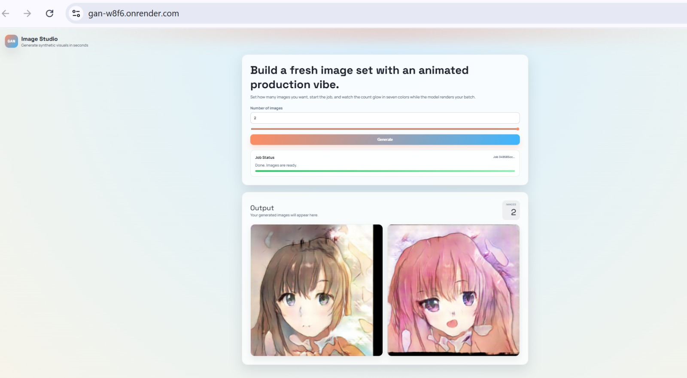
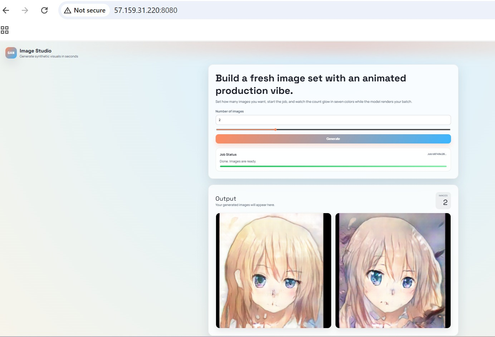
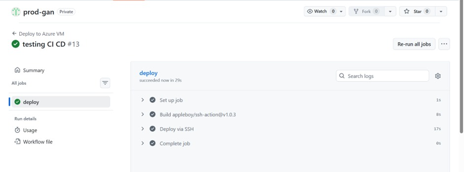
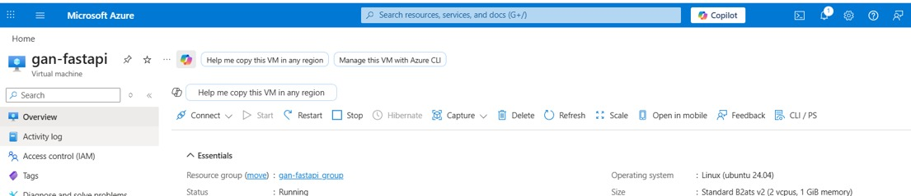

<p align="center">
  
</p>

<h1 align="center">🎨GAN Image Generator</h1>

<p align="center">
  <b>Generate synthetic anime-style images on demand using a custom-trained GAN — backed by FastAPI, RabbitMQ workers, and a polished browser UI.</b>
</p>

<p align="center">
  <a href="https://gan-w8f6.onrender.com"></a>
</p>

<p align="center">
  
  
  
  
  
  
  
</p>

---

## ✨ Features

| Feature | Description |
|---|---|
| **Custom GAN Model** | 256×256 anime-style image generator with a 6-layer `ConvTranspose2d` architecture |
| **Async Job Queue** | RabbitMQ decouples the API from heavy inference, enabling horizontal scaling |
| **Real-Time Polling** | Frontend polls job status every 2s with animated progress & rainbow effects |
| **Cloud Media Storage** | Generated images are uploaded to **Cloudinary** — no local disk dependency |
| **Metadata Tracking** | Every job is tracked in **Supabase** (PostgreSQL) with status & output URLs |
| **GIF Generation** | Latent-space interpolation creates smooth morph GIFs between generated faces |
| **Docker Ready** | Single `Dockerfile` runs both the API server and background worker |
| **CI/CD Pipeline** | GitHub Actions auto-deploys to Azure VM on every push to `main` |

---

## 🏗️ Architecture

```
┌──────────────────────────────────────────────────────────────────────┐
│                        CLIENT  (Browser)                           │
│           static/index.html  ·  styles.css  ·  app.js              │
└──────────────────┬───────────────────────────────┬───────────────────┘
                   │  POST /generate/image         │  GET /job/{id}/details
                   ▼                               ▼
┌──────────────────────────────────────────────────────────────────────┐
│                     FastAPI  (api_main.py)                          │
│  • Accepts generation requests                                     │
│  • Creates job record in Supabase                                  │
│  • Publishes job to RabbitMQ                                       │
│  • Returns job status & image URLs                                 │
└──────────┬──────────────────────┬────────────────────────────────────┘
           │                      │
           ▼                      ▼
  ┌─────────────────┐    ┌─────────────────┐
  │   Supabase DB   │    │    RabbitMQ      │
  │  (Metadata)     │    │  (Job Queue)     │
  └─────────────────┘    └────────┬─────────┘
                                  │
                                  ▼
              ┌───────────────────────────────────┐
              │    Worker  (image_worker.py)       │
              │  • Consumes jobs from queue        │
              │  • Runs GAN inference (PyTorch)    │
              │  • Uploads images to Cloudinary    │
              │  • Updates job status in Supabase  │
              └───────────────────────────────────┘
```

---

## 📸 Screenshots

### 🖼️ Deployed Application — Live UI

<p align="center">
  
</p>

### 🚀 CI/CD Pipeline — GitHub Actions → Azure VM

<p align="center">
  
</p>

### ☁️ Azure Virtual Machine

<p align="center">
  
</p>

---

## 📂 Project Structure

```
prod-gan/
├── .github/workflows/deploy.yml        # CI/CD: SSH deploy to Azure VM
├── config/
│   ├── config.yaml                     # Model paths, queue names, storage config
│   └── yaml_utils.py                   # YAML read/write/update utilities
├── model/
│   └── generator_256_256_3.pth         # Pre-trained GAN weights (~49 MB)
├── src/
│   ├── core/job_enum.py                # JobStatus enum (PENDING → COMPLETED/FAILED)
│   ├── database_operation/
│   │   ├── media_storage.py            # Cloudinary upload/retrieve
│   │   └── metadata_db.py             # Supabase CRUD for job metadata
│   ├── fastapi/api_main.py            # FastAPI app & routes
│   ├── inference/
│   │   ├── gan_model_inference_image.py    # Image generation pipeline
│   │   ├── gan_model_inference_gif.py      # GIF interpolation pipeline
│   │   └── utils/gan_model_inference_utils.py  # Generator256 architecture
│   ├── queue/publisher.py              # RabbitMQ publisher
│   └── worker/image_worker.py          # RabbitMQ consumer / background worker
├── static/                             # Frontend (HTML + CSS + JS)
├── Dockerfile
└── requirements.txt
```

---

## ⚙️ Tech Stack

| Layer | Technology |
|---|---|
| **ML Framework** | PyTorch 2.5 + TorchVision |
| **API** | FastAPI + Uvicorn |
| **Message Queue** | RabbitMQ (via `pika`) |
| **Database** | Supabase (PostgreSQL) |
| **Media Storage** | Cloudinary |
| **Frontend** | Vanilla HTML / CSS / JS |
| **Containerization** | Docker |
| **Deployment** | Azure VM (Ubuntu 24.04) |
| **CI/CD** | GitHub Actions + SSH |

---

## 📋 Job Lifecycle

```
PENDING  ──▶  PROCESSING  ──▶  COMPLETED
                  │
                  └──▶  FAILED
```

1. **PENDING** — Job created in Supabase, message published to RabbitMQ
2. **PROCESSING** — Worker picks up the job, runs GAN inference
3. **COMPLETED** — Images uploaded to Cloudinary, URLs saved to Supabase
4. **FAILED** — Error during inference or upload

---

<p align="center">
  Built with ❤️ using PyTorch, FastAPI, and a lot of latent vectors.
</p>
